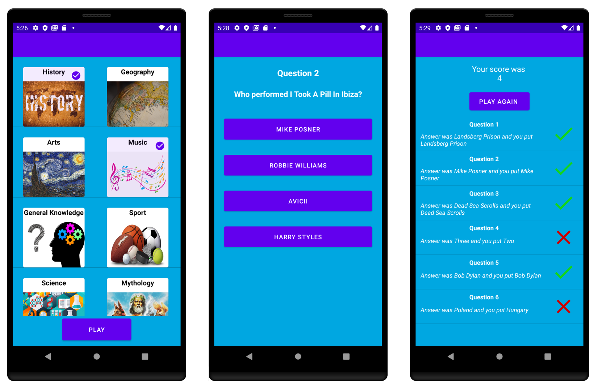

# A Simple quiz Android application developed in Kotlin

* Test your knowledge with a range of different categories of questions

* Score is calculated and results are displayed end of quiz

## Additional Libraries

* [Groupie](https://github.com/lisawray/groupie)

## References

I do not own images for quiz categories shown in screenshot above or questions used in application this was developed strictly non-commercial

Below are references for images of categories shown and questions asked

### Image references 

* History category image: https://jessicamdewitt.wordpress.com/2017/06/26/history-new-week/

* Geography category image: https://www.magd.cam.ac.uk/undergraduate/courses/geography 

* Art category image: https://www.britannica.com/topic/The-Starry-Night

* Music category image: https://weheartit.com/articles/345492998-the-bops 

* General Knowledge image: https://www.peterboroughmatters.co.uk/entertainment/quiz-how-good-is-your-general-knowledge-2817 

* Sport image: https://www.proprofs.com/quiz-school/story.php?title=sport-quiz-the-ryder-cup

* Science image: https://www.vox.com/science-and-health/2017/3/24/15028396/march-for-science-diversity 

* Mythology image: https://www.pcgamer.com/age-of-mythology-might-be-making-a-comeback-soon/

### Question references 

* https://opentdb.com/api_config.php 

 

